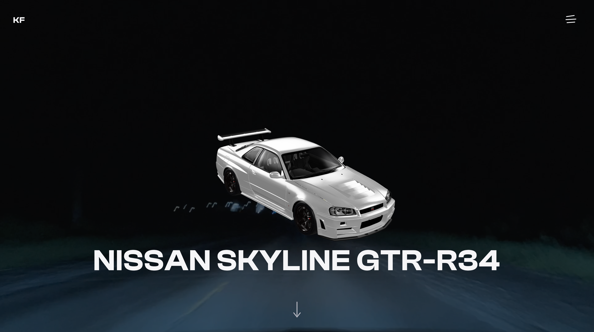

# Nissan Skyline GT-R R34 — Landing Page

A Landing page for the Nissan Skyline GT-R R34, built with vanilla JavaScript, HTML and CSS — featuring an interactive 3D car model, a fullscreen menu, scroll-triggered animations and a dark premium design.

## Features

- Interactive 3D car model in the hero section via [`<model-viewer>`](https://modelviewer.dev/)
- Video background with dimming overlay
- Fullscreen navigation overlay with an animated, flipping menu icon
- Photo gallery with grayscale-to-color hover effect
- Technical specs rendered dynamically from a data file
- Scroll-triggered reveal animations (Intersection Observer)
- Fully responsive, including a dedicated mobile layout for the 3D model

## Tech Stack

- HTML, CSS, vanilla JavaScript (no frameworks)
- [`<model-viewer>`](https://modelviewer.dev/) — 3D model rendering
- Self-hosted fonts: Clash Display & Satoshi (via [Fontshare](https://www.fontshare.com/))

## Getting Started

1. Clone the repository
2. Open `index.html` with a local server (e.g. VS Code's Live Server extension)

No build step or dependencies required.

## 3D Model Credit

- "2005 Nismo Nissan Skyline R34 GTR Z Tune" by [Ddiaz Design](https://sketchfab.com/ddiaz-design) — CC-BY-NC-SA-4.0, sourced from [Sketchfab](https://sketchfab.com)

## Author

Fabian Klemenz
